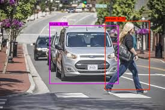

# YoloV2
YoloV2 quick implementation using darknet and yad2k (Yet another darknet 2 keras)  
## This repo will demostrate Object detection mechanism in real time which was usually been used for finding obstacles in driverless cars  

Libraries been used:  
Darknet: https://pjreddie.com/darknet/yolo/   by(Joseph Redmon)  
YAD2k: https://github.com/allanzelener/YAD2K  by(allanzelener)

Tensorflow (1.3.0)  
Keras(2.0.3)

